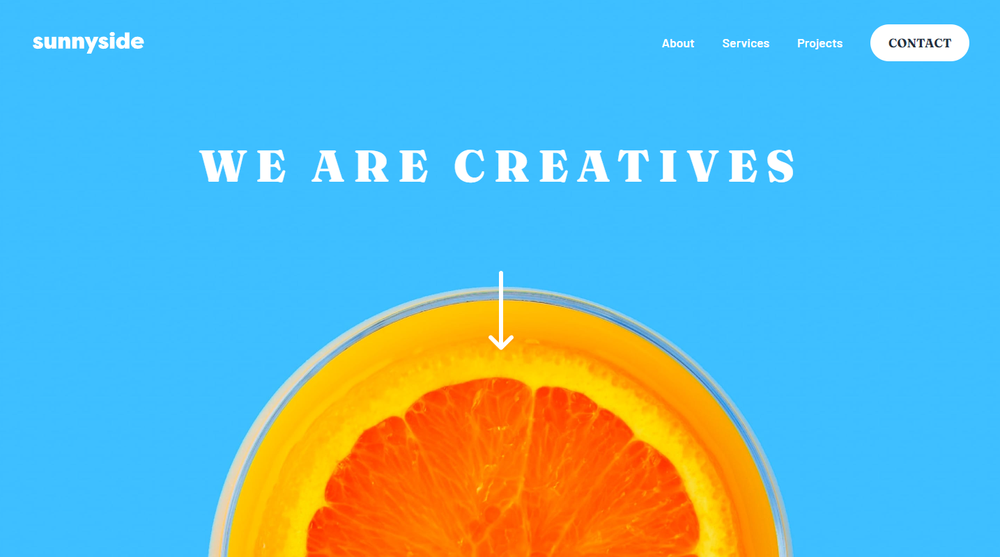

# Agency Landing Page

*Caption: Desktop view of the Agency Landing Page*

*Caption: Mobile view of the Agency Landing Page*

I created an **Agency Landing Page** as part of the [Frontend Mentor](https://www.frontendmentor.io/challenges/sunnyside-agency-landing-page-7yVs3B6ef) challenge. This is an elegant and responsive web page.

## Link

You can see a live demo of the **Agency Landing Page** [here](https://lawrpunk.github.io/agency-landing-page/).

## Features

- Responsive design for any screen size.
- Hamburger menu for mobile for easy access to site content.

## Technologies Used

- HTML
- CSS
- JavaScript

## Acknowledgments

- [Frontend Mentor](https://www.frontendmentor.io/) for the challenge
